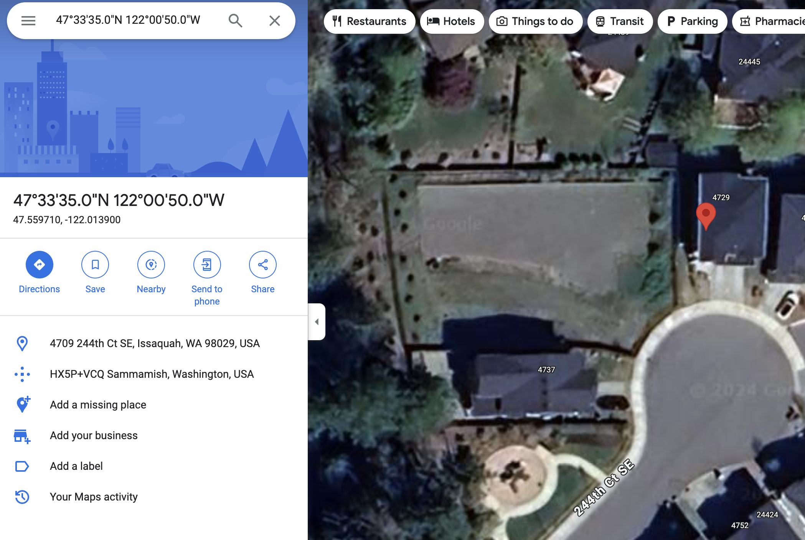
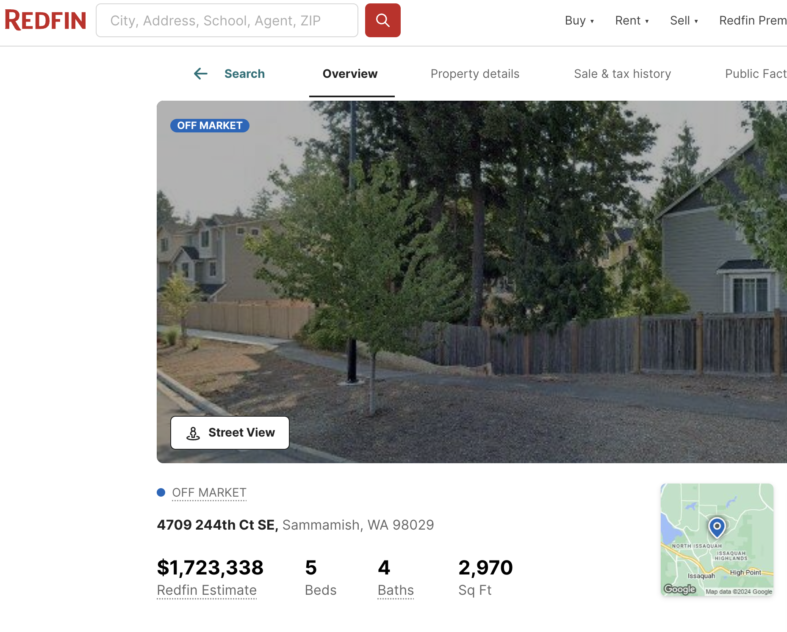



```{webr}
#| label: setup
#| include: false
#| autorun: true

theme_set(theme_classic())

kc.houses <- read.csv("king.county.sales.recent.csv")
classroster <- read.csv("classroster.csv", fileEncoding="UTF-8-BOM")

kc.houses <- kc.houses %>% 
  mutate(view = ifelse(rowSums(across(starts_with("view"))) > 0, 1, 0)) %>% 
  mutate(wfnt = factor(wfnt, levels=c(0, 1), labels=c("Not on waterfront", "On waterfront"))) %>% 
  mutate(view = factor(view, levels=c(0, 1), labels=c("No view", "View")))

```

# Association and correlation

## Exercise 1

In your pairs, try to think of two variables that, in the real world, that might have this correlation for each of the following correlations. Try to think of a few examples for each correlation.

-   0.95
-   0.75
-   0.5
-   0.25
-   0.0
-   -0.25
-   -0.5
-   -0.75
-   -0.95

Pick a few of these and draw by hand what you expect these graphs to look like.

```{webr}
#| label: pick1

sample(classroster$name, 1)
```

## Exercise 2

{width="800"}

## Viewing an example relationship

-   First, what is our expectation about the relationship between bedrooms and square feet?
-   Direction?
-   Form?
-   Strength?
-   Outliers?

## Bedrooms and square feet - direction

A scatterplot is the easiest way to check for direction. In this case, the direction is obvious

```{webr}
#| label: bsqdirection

# should we jitter this?
ggplot(kc.houses, aes(x=sqft, y=beds)) + 
  geom_point() +
  labs(x="Square feet", y="Beds")
```

## Bedrooms and square feet - form

```{webr}
#| label: bsqform

ggplot(kc.houses, aes(x=sqft, y=beds)) + 
  geom_point(position="jitter") +
  geom_smooth(method="loess", se=FALSE) +
  labs(x="Square feet", y="Beds")
```

## Bedrooms and square feet - strength

```{webr}
#| label: bsqstrength

ggplot(kc.houses, aes(x=sqft, y=beds)) + 
  geom_point(position="jitter") +
  geom_smooth(method="loess", se=FALSE) +
  labs(x="Square feet", y="Beds")
```

### Correlation as a measure of strength

```{webr}
#| label: bsqcorr

kable(kc.houses %>% 
        summarize(cor(beds, sqft, use="complete.obs")), col.names="Correlation")
```

This correlation is a little weaker than perhaps what we expected

-   In general, mechanically generated processes with little noise can have very high correlations
-   Most correlations of social or real world processes rarely have above moderate correlation due to noise

## Bedrooms and square feet - outlier

Again, we do not have a rule for selecting outliers other than to observe them on the scatterplot. In this case, there is one very obvious value far from other values

```{webr}
#| label: bsqoutlierplot

ggplot(kc.houses, aes(x=sqft, y=beds)) + 
  geom_point(position="jitter") +
  geom_smooth(method="loess", se=FALSE)  +
  geom_text(data=kc.houses %>% filter(sqft > 2500 & beds < 1), # Filter data first
    aes(label=beds), vjust=0.5, color="red") +
  labs(x="Square feet", y="Beds")
```

To investigate if this outlier matters, we can check some other values of the observation.

```{webr}
#| label: bsqoutlier

kable(
  kc.houses %>%
    filter(sqft > 2500 & beds < 1) %>%
    select(c(sale_price, sqft, sqft_lot, beds, stories)))
```

What kind of outlier do you think this is? Why?

### Outlier - actual observation

```{webr}
#| label: bsqoutlier1

kable(
  kc.houses %>%
    filter(sqft > 2500 & beds < 1) %>%
    select(c(latitude, longitude)))
```

{width="800"}

{width="800"}

### Data with no outlier

```{webr}
#| label: bsqnooutlier
#| message: false

#should we jitter this?
kc.houses %>%
  filter(sqft < 2500 | beds > 1) %>%  
  ggplot(aes(x=sqft, y=beds)) + 
    geom_point(position="jitter") +
    geom_smooth(method="loess", se=FALSE) +
    labs(x="Square feet", y="Beds")
```

### Describing the association

1.  Direction - positive
2.  Form - linear
3.  Strength - moderate/strong
4.  Outliers - one possible

Outlier:

```{webr}
#| label:  bsqoutlier2

kable(
  kc.houses %>%
    filter(sqft>2500 & beds < 1) %>%
    select(c(sale_price, sqft, sqft_lot, latitude, longitude)))
```

## Does bed and square feeet relationship match expectations?

-   Seems to, more or less, the larger the house, the more bedrooms, so the relationship is positive
-   The relationship is fairly linear, indicating a strong relationship
-   Relationship is moderate
-   Outliers don't seem like it is a problem

However....

-   What are some possible lurking variables that influence the relationship of bedrooms and bathrooms?

```{webr}
#| label: pick2

sample(classroster$name, 1)
```

## Relationship reexpressed?

One final issue to consider is if this relationship should be reexpressed - made more linear.

```{webr}
#| label: bsqreexpress

kc.houses %>%
  mutate(log.sqft = log(sqft)) %>%
  ggplot(aes(x=log.sqft, y=beds)) + 
    geom_point() +
    geom_smooth(method="lm", se=FALSE) +
    labs(x="Log square feet", y="Beds")
```

-   Seems clearer

### Your turn

With your partner, develop some expectations about some of the variables in the `kc.houses` dataset might be related.

Variables:

```{webr}
#| label: datasetdetails

kc.houses.short <- kc.houses %>% 
  select(c(sale_price, year_built, sqft, sqft_lot, beds, bath_full, view, stories))

kable(names(kc.houses.short), col.names=c("Variables"))
```

What to do with your partner:

1.  Write down an interesting question we think we might be able to answer by examining a relationship in this dataset
2.  Choose the variables that you think might be able to answer this question
3.  Write down what you expect the relationship to be between these two variables based on any prior knowledge
4.  Decide which variable is the response variable and which is the predictor variable
5.  Make a scatterplot using one of the codeblocks in the previous section and identify the features of the association

```{webr}
#| label: pick3
sample(classroster$name, 1)
```