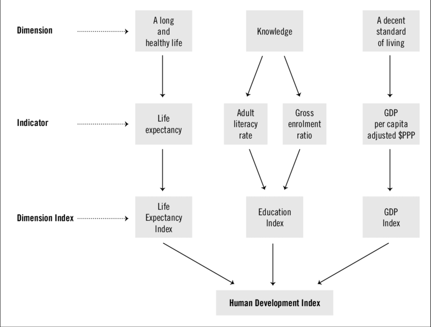



```{webr}
#| label: setup
#| include: false
#| autorun: true

theme_set(theme_classic())

global.data <- read.csv("Country_data.csv")
classroster <- read.csv("classroster.csv", fileEncoding="UTF-8-BOM")

global.data <- global.data %>% 
  mutate(gdp.capita = World.Bank.Forecast.GDP.PPP. / Population.2023 * 10,
         hdi.score = HDI) %>% 
  filter(if_all(c(gdp.capita, hdi.score), ~ !is.na(.)))

global.data.nooutlier <- global.data %>%
  filter(gdp.capita > 1)

global.data.log <- global.data %>%
  mutate(log.gdp.capita = log(gdp.capita))

global.data.log.nooutlier <- global.data.log %>% 
  filter(log.gdp.capita > -6)

hdi.model <- lm(hdi.score ~ gdp.capita, data=global.data)
global.data.augmented <- augment(hdi.model, global.data)
hdi.model.tidy <- tidy(hdi.model)

hdi.model.nooutlier <- lm(hdi.score ~ gdp.capita, data=global.data.nooutlier)  
global.data.augmented.nooutlier <- augment(hdi.model.nooutlier, global.data.nooutlier)
hdi.model.tidy.nooutlier <- tidy(hdi.model.nooutlier)

hdi.model.log <- lm(hdi.score ~ log.gdp.capita, data=global.data.log)
global.data.augmented.log <- augment(hdi.model.log, global.data.log)
hdi.model.tidy.log <- tidy(hdi.model.log)

hdi.model.log.nooutlier <- lm(hdi.score ~ log.gdp.capita, data=global.data.log.nooutlier)
global.data.augmented.log.nooutlier <- augment(hdi.model.log.nooutlier, global.data.log.nooutlier)
hdi.model.tidy.log.nooutlier <- tidy(hdi.model.log.nooutlier)
```

```{r}
#| label: rsetup
#| include: false

library(tidyverse)
library(broom)

global.data <- read.csv("datasets/Country_data.csv")

global.data <- global.data %>% 
  mutate(gdp.capita = World.Bank.Forecast.GDP.PPP. / Population.2023 * 10,
         hdi.score = HDI) %>% 
  filter(if_all(c(gdp.capita, hdi.score), ~ !is.na(.)))

global.data.log <- global.data %>%
  mutate(log.gdp.capita = log(gdp.capita))

global.data.nooutlier <- global.data %>%
  filter(gdp.capita > 1)

global.data.log.nooutlier <- global.data.log %>% 
  filter(log.gdp.capita > -6)

hdi.model <- lm(hdi.score ~ gdp.capita, data=global.data)
global.data.augmented <- augment(hdi.model, global.data)
hdi.model.tidy <- tidy(hdi.model)

hdi.model.nooutlier <- lm(hdi.score ~ gdp.capita, data=global.data.nooutlier)  
global.data.augmented.nooutlier <- augment(hdi.model.nooutlier, global.data.nooutlier)
hdi.model.tidy.nooutlier <- tidy(hdi.model.nooutlier)

hdi.model.log <- lm(hdi.score ~ log.gdp.capita, data=global.data.log)
global.data.augmented.log <- augment(hdi.model.log, global.data.log)
hdi.model.tidy.log <- tidy(hdi.model.log)

hdi.model.log.nooutlier <- lm(hdi.score ~ log.gdp.capita, data=global.data.log.nooutlier)
global.data.augmented.log.nooutlier <- augment(hdi.model.log.nooutlier, global.data.log.nooutlier)
hdi.model.tidy.log.nooutlier <- tidy(hdi.model.log.nooutlier)
```


# Linear model

## Line of best fit



How to describe the relationship between `GDP per capita` and `HDI score`?

As we learned:

- Direction
- Form
- Strength
- Outlier

What do you expect the relationship between GDP per capita and HDI will be?

```{webr}
#| label: picker0
sample(classroster$name, 1)
```

## Scatterplot of `GDP per capita` and `HDI`

```{webr}
#| label: fig-hdiscatterplot
#| caption: "HDI as a function of GDP/cap"
ggplot(global.data, aes(x=gdp.capita, y=hdi.score)) +
  geom_point() +
  labs(x="GDP per capita (10000 USD) in PPP terms", y="Human Development Index (HDI) score")
```

### Smoother

```{webr}
#| label: fig-hdismoother
#| caption: "HDI as a function of GDP/cap with smoother"
ggplot(global.data, aes(x=gdp.capita, y=hdi.score)) +
  geom_point() +
  labs(x="GDP per capita (10000 USD) in PPP terms", y="Human Development Index (HDI) score") +
  geom_smooth(se=FALSE)
```

### Taking a guess

What do you think the intercept and the slope should be for a line of 'good' fit?

```{webr}
#| label: picker1
sample(classroster$name, 1)
```

```{webr}
#| label: fig-guessslope
#| caption: "HDI as a function of GDP/cap"
ggplot(global.data, aes(x=gdp.capita, y=hdi.score)) +
  geom_point() +
  labs(x="GDP per capita (10000 USD) in PPP terms", y="Human Development Index (HDI) score") +
  geom_abline(intercept = 0, slope=0, color="blue")
```

### Least squares line

>Slope: `r format(hdi.model.tidy$estimate[2], scientific=FALSE)`, intercept: `r format(hdi.model.tidy$estimate[1], scientific=FALSE)` 

```{webr}
#| label: fig-leastsquares
#| caption: "HDI as a function of GDP/cap with least squares line"
ggplot(global.data, aes(x=gdp.capita, y=hdi.score)) +
  geom_point() +
  labs(x="GDP per capita (10000 USD) in PPP terms", y="Human Development Index (HDI) score") +
  geom_smooth(method="lm", se=FALSE)
```

## Linear model

It's better if we come up with a more formal model: $\hat{y}= b_0 + b_1x$

$\hat{y}$ is our predicted value
$b_0$ is the $y$ intercept - the value when $x$ is 0
$b_1$ is the slope

- Helps with predictions
  + For values not in the sample, we can estimate their `HDI score`
- Helps assess model fit - we can compare different lines more easily
  + More specifically we can calculate the **residuals**
  + Residuals are difference between our line and the actually observed value - how much our line 'missed' by

### Linear model for our data

$\hat{y}= `r format(hdi.model.tidy$estimate[1], scientific=FALSE)` + `r format(hdi.model.tidy$estimate[2], scientific=FALSE)`x$

```{webr}
#| label: fig-leastsquares2
#| caption: "HDI as a function of GDP/cap with least squares line"
ggplot(global.data, aes(x=gdp.capita, y=hdi.score)) +
  geom_point() +
  labs(x="GDP per capita (10000 USD) in PPP terms", y="Human Development Index (HDI) score") +
  geom_smooth(method="lm", se=FALSE)
```

## Least squares line

- But how to calculate? 
- Many different ways
  + Make a line minimizing the least absolute deviations
  + Non-parametric lines
  + Make a line minimizing the sum of the squares of the deviations
- Least squares line is most common
  + Advantages: 
    + Easy to calculate
    + Well understood statistical properties
  + Disadvantages: 
    + Line will be strongly influenced by outliers

## Examining model fit

- Checking the residuals
- Residual standard deviation
- $R^2$
- Checking assumptions

### Checking the residuals

All real datasets have noise so the real formula is:

$y = b_0 + b_1x + e$

Residual = Observed - Predicted
  
  + $e = y - \hat{y}$

Can easily plot the residuals, put the  "size of the miss" on the $y$ axis, and original data on the $x$ axis

### Residuals - our data

```{webr}
#| label: fig-dataresiduals
#| caption: "HDI model with residuals"
ggplot(global.data.augmented, aes(gdp.capita, hdi.score)) + 
  geom_point() + 
  geom_smooth(method="lm", se=FALSE) +
  geom_segment(aes(xend = gdp.capita, yend = .fitted), linetype="dashed") + 
  labs(x="GDP per capita (10000 USD) in PPP terms", y="Human Development Index (HDI) score") 
```

## Graphing the residuals

```{webr}
#| label: fig-residualsplot
#| caption: "HDI model residuals plot"
ggplot(global.data.augmented, aes(gdp.capita, .resid)) + 
  geom_point() + 
  geom_hline(yintercept = 0, color = "blue", linetype='dashed') + 
  labs(y = "Residuals", x="GDP per capita (10000 USD) in PPP terms")
```

### Residuals vs. observed data

```{webr}
#| label: fig-residualvsobserved
#| caption: "Residuals vs. observed data"
original <-
  ggplot(global.data, aes(x=gdp.capita, y=hdi.score)) +
  geom_point() +
  labs(x="GDP per capita (10000 USD) in PPP terms", y="Human Development Index (HDI) score") +
  geom_smooth(method="lm", se=FALSE)

resids <- ggplot(global.data.augmented, aes(gdp.capita, .resid)) + 
  geom_point() + 
  geom_hline(yintercept = 0, color = "blue", linetype='dashed') + 
  labs(y = "Residuals", x="GDP per capita (10000 USD) in PPP terms")

grid.arrange(original, resids)
```

## Residual standard deviation

- Since the residuals are just another distribution, we can also examine their distribution
  + What to look for: symmetrical, no skew/outliers 
  + Standard deviation not too large

### Residual standard deviation - our data

```{webr}
#| label: fig-residualstddev
#| caption: "HDI model residuals distribution"
ggplot(global.data.augmented, aes(x=.resid)) +
  geom_histogram(fill="blue4") +
  labs(x="Residuals", y="Count")
```

How would you interpret this histogram of the residuals?

```{webr}
#| label: picker3
sample(classroster$name, 1)
```

## $R^2$

$R^2$ is just the return of $r$, the correlation coefficient. Remember:

- $r$ measures the strength of the association between $x$ and $y$
  + That is, how reliably $x$ varies with $y$

- The correlation coefficient: `r round(cor(global.data$hdi.score, global.data$gdp.capita), digits=2)`
- Our $R^2$: `r as.numeric(round(glance(hdi.model)[1], digits=2))`

```{webr}
#| label: modelfit
global.data.nooutlier <- global.data %>%
  filter(gdp.capita < 100000)

hdi.model.nooutlier <- lm(hdi.score ~ gdp.capita, data=global.data.nooutlier)  
global.data.augmented.nooutlier <- augment(hdi.model.nooutlier, global.data.nooutlier)
hdi.model.tidy.nooutlier <- tidy(hdi.model.nooutlier)
```

What do you think the $R^2$ will change to when we remove the outlier?

```{webr}
#| label: picker4
sample(classroster$name, 1)
```

- The correlation coefficient for a model with the outlier removed: 

```{webr}
#| label: correlationnooutlier
round(cor(global.data.nooutlier$hdi.score, global.data.nooutlier$gdp.capita), digits=2)
```

- Our $R^2$ with the outlier removed: 

```{webr}
#| label: rsquarednooutlier

as.numeric(round(glance(hdi.model.nooutlier)[1], digits=2))
```

## How to interpret $R^2$

- If there are no serious outliers and the relationship is linear, can provide a useful measure of how strongly the predictor variable is related to the response variable
  + The two assumptions above are quite strong - you need to always draw a picture to make sure they are true!
  + Should not be interpreted as how strongly $x$ *causes* $y$, we only know about association.

## Regression assumptions

- Quantitative variable assumption
- Straight enough condition
- Outlier condition
- Does the plot thicken condition?

Have we met these? 

```{webr}
#| label: picker5
sample(classroster$name, 1)
```

## Reexpressions

### Log reexpressed

```{webr}
#| label: logreexpress
global.data.log <- global.data %>%
  mutate(log.gdp.capita = log(gdp.capita))

hdi.model.log <- lm(hdi.score ~ log.gdp.capita, data=global.data.log)
global.data.augmented.log <- augment(hdi.model.log, global.data.log)
hdi.model.tidy.log <- tidy(hdi.model.log)
```

What will happen to the shape of the graph?

```{webr}
#| label: picker6
sample(classroster$name, 1)
```

```{webr}
#| label: fig-logreexpressplot
#| caption: "HDI model with log reexpression"
ggplot(global.data.log, aes(x=log.gdp.capita, y=hdi.score)) +
  geom_point() +
  labs(x="Log of GDP per capita (10000 USD) in PPP terms", y="Human Development Index (HDI) score") +
  geom_smooth(method="lm", se=FALSE)
```

### Log reexpressed - outlier

Any guess as to the outlier?

```{webr}
#| label: picker7
sample(classroster$name, 1)
```

```{webr}
#| label: fig-modeloutlier
#| caption: "HDI model - outlier"
ggplot(global.data.log, aes(x=log.gdp.capita, y=hdi.score)) +
  geom_point(aes(color = log.gdp.capita < -6)) +  # color conditionally
  scale_color_manual(values = c("FALSE" = "black", "TRUE" = "red")) +
  geom_text(
    data = subset(global.data.log, log.gdp.capita < -6),  # only label those < -6
    aes(label = Country),
    vjust = -0.5,
    color = "red"
  ) + 
  labs(x="Log of GDP per capita (10000 USD) in PPP terms", y="Human Development Index (HDI) score") 
```

### Outlier

```{webr}
#| label: outliers
#| caption: "Outlier information"
global.data.log %>% 
  filter(log.gdp.capita < -6) %>% 
  mutate(`World Bank PPP GDP estimate` = World.Bank.Forecast.GDP.PPP.*100000,
         `Population 2023` = Population.2023,
         `GDP per capita` = gdp.capita*100000) %>% 
  select(c(Country, HDI, `World Bank PPP GDP estimate`, `Population 2023`, `GDP per capita`)) %>% 
  kable()
```


### Graphing the residuals - log

```{webr}
#| label: fig-residualslog
#| caption: "HDI model log/no outlier - residuals"
ggplot(global.data.augmented.log.nooutlier, aes(log.gdp.capita, .resid)) + 
  geom_point() + 
  geom_hline(yintercept = 0, color = "blue", linetype='dashed') + 
  labs(y = "Residuals", x="Log of GDP per capita (10000 USD) in PPP terms")
```

### Residuals standard deviation - log

```{webr}
#| label: fig-residualsstddevlog
#| caption: "HDI model log/no outlier - residuals distribution"
ggplot(global.data.augmented.log.nooutlier, aes(x=.resid)) +
  geom_histogram(fill="blue4") +
  labs(x="Residuals", y="Count")
```

### $R^2$

- The correlation coefficient: `r round(cor(global.data.log.nooutlier$hdi.score, global.data.log.nooutlier$log.gdp.capita), digits=2)`
- Our $R^2$: `r as.numeric(round(glance(hdi.model.log.nooutlier)[1], digits=2))`

### Regression assumptions

For the log reexpressed version, have the assumptions been met?

- Quantitative variable assumption 
- Straight enough condition
- Outlier condition
- Does the plot thicken condition?

```{webr}
#| label: picker8
sample(classroster$name, 1)
```