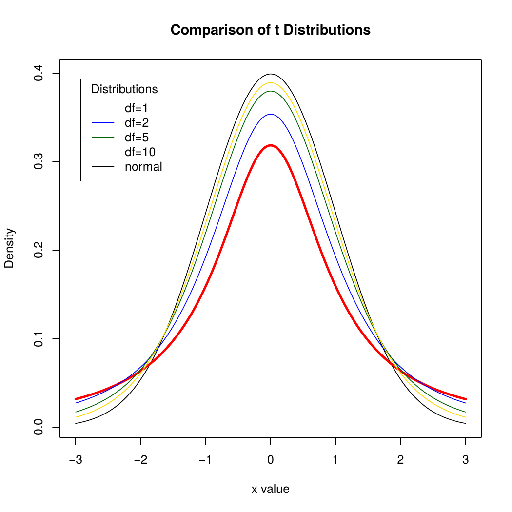



```{webr setup, include=FALSE}
#| label: setup
#| autorun: true
#| include: false

theme_set(theme_classic())

options(scipen=999)

mean.multiple.samples <- function(numdraws, numsamples, variable) { 
     meanvector <- c() 
     meanonesample <- 0 
     for (i in 1:numsamples) { 
	   meanonesample <- mean(sample(variable, numdraws, replace=TRUE)) 
         meanvector[i] <- meanonesample 
     } 
     meanvector 
}

kc.house <- read.csv("king.county.sales.recent.csv")
classroster <- read.csv("classroster.csv", fileEncoding="UTF-8-BOM")
```

```{r}
#| label: rsetup
#| include: false

library(dplyr)

options(scipen=999)

kc.house <- read.csv("datasets/king.county.sales.recent.csv")

set.seed(12345678)
sample20 <- sample(kc.house$sale_price, 20, replace=TRUE)

upper.bound <- round((mean(sample20) + (qt(0.975,df=19) * sd(sample20) / sqrt(19))), digits=0)
lower.bound <- round((mean(sample20) - (qt(0.975,df=19) * sd(sample20) / sqrt(19))), digits=0)
```


{width="800"}

# Confidence intervals - means

-   The central limit theorem
-   A confidence interval for the mean
-   Interpreting confidence intervals
-   Picking our interval up by our bootstraps
-   Thoughts about confidence intervals

## House price revisited

-   Prices in King County Houses:
    -   `r as.numeric(kc.house %>% summarize(n=n()))` houses
    -   Highly right skewed
    -   Can define this as the entire population
    -   Prices are quantitative

### House price graph

```{webr}
#| label: fig-pricedensity
#| caption: "Density plot of house prices"
ggplot(kc.house, aes(x=sale_price)) +
  geom_histogram(aes(y=..density..),  fill="lightblue", color="darkblue") +
  labs(x="Price in USD", y="Density") +
  scale_x_continuous(labels=scales::label_comma()) +
  scale_y_continuous(labels=scales::label_comma())
```

### Distribution

-   Distribution:

    -   Min: `r round(min(kc.house$sale_price), digits=0)`
    -   Q1: `r round(quantile(kc.house$sale_price, probs=0.25), digits=0)`
    -   Med: `r round(median(kc.house$sale_price), digits=0)`
    -   Q3: `r round(quantile(kc.house$sale_price, probs=0.75), digits=0)`
    -   Max: `r round(max(kc.house$sale_price), digits=0)`
    -   Mean: `r round(mean(kc.house$sale_price), digits=0)`
    -   SD: `r round(sd(kc.house$sale_price), digits=0)`

-   Highly right skewed

-   SD almost as large as the median

-   If a distribution looks like this, what do you think the sampling distribution will look like when n=25? How about when n=200?

```{webr}
#| label: picker1
sample(classroster$name, 1)
```

## The central limit theorem

-   The Central Limit Theorem
    -   The sampling distribution of any mean becomes nearly Normal as the sample size grows.
-   **Requirements**
    -   Observations independent
    -   Randomly collected sample
-   The sampling distribution of the means is close to Normal if **either**:
    -   Large sample size
    -   Population close to Normal

### Samples = 100, $n$ = 200

```{webr}
#| label: fig-samplingdistn200d100
#| caption: "Sampling distribution of mean, n=200, draws=100"
houses <- mean.multiple.samples(200, 100, kc.house$sale_price)

ggplot(data.frame(houses), aes(x=houses)) +
  geom_histogram(aes(y=..density..),  fill="lightblue", color="darkblue") +
  geom_density(color="darkred", size=1) +
  labs(x="Price in USD", y="Density") +
  scale_x_continuous(labels=scales::label_comma()) +
  scale_y_continuous(labels=scales::label_comma())
```

### Samples = 1000, $n$ = 200

```{webr}
#| label: fig-samplingdistn200d1000
#| caption: "Sampling distribution of mean, n=200, draws=1000"
houses <- mean.multiple.samples(200, 1000, kc.house$sale_price)

ggplot(data.frame(houses), aes(x=houses)) +
  geom_histogram(aes(y=..density..),  fill="lightblue", color="darkblue") +
  geom_density(color="darkred", size=1) +
  labs(x="Price in USD", y="Density") +
  scale_x_continuous(labels=scales::label_comma()) +
  scale_y_continuous(labels=scales::label_comma())
```

### Samples = 100000, $n$ = 200

```{webr}
#| label: fig-samplingdistn200d10000
#| caption: "Sampling distribution of mean, n=200, draws=10000"
houses <- mean.multiple.samples(200, 100000, kc.house$sale_price)

ggplot(data.frame(houses), aes(x=houses)) +
  geom_histogram(aes(y=..density..),  fill="lightblue", color="darkblue") +
  geom_density(color="darkred", size=1) +
  labs(x="Price in USD", y="Density") +
  scale_x_continuous(labels=scales::label_comma()) +
  scale_y_continuous(labels=scales::label_comma())
```

## Sampling distribution shape

-   As number of samples taken goes to infinity, shape of the **sampling** distribution becomes more clearly normally shaped

-   Doesn't matter the shape of the underlying distribution except for a very few exceptions

-   How about holding samples fixed and changing $n$ in our sample of a skewed distribution?

### $n$ = 10

```{webr}
#| label: fig-samplingdistn10d100000
#| caption: "Sampling distribution of mean, n=10, draws=100000"
houses <- mean.multiple.samples(10, 100000, kc.house$sale_price)

ggplot(data.frame(houses), aes(x=houses)) +
  geom_histogram(aes(y=..density..),  fill="lightblue", color="darkblue") +
  geom_density(color="darkred", size=1) +
  labs(x="Price in USD", y="Density") +
  scale_x_continuous(labels=scales::label_comma()) +
  scale_y_continuous(labels=scales::label_comma())
```

### $n$ = 25

```{webr}
#| label: fig-samplingdistn25d100000
#| caption: "Sampling distribution of mean, n=25, draws=100000"
houses <- mean.multiple.samples(25, 100000, kc.house$sale_price)

ggplot(data.frame(houses), aes(x=houses)) +
  geom_histogram(aes(y=..density..),  fill="lightblue", color="darkblue") +
  geom_density(color="darkred", size=1) +
  labs(x="Price in USD", y="Density") +
  scale_x_continuous(labels=scales::label_comma()) +
  scale_y_continuous(labels=scales::label_comma())
```

### $n$ = 50

```{webr}
#| label: fig-samplingdistn50d100000
#| caption: "Sampling distribution of mean, n=50, draws=100000"
houses <- mean.multiple.samples(50, 100000, kc.house$sale_price)

ggplot(data.frame(houses), aes(x=houses)) +
  geom_histogram(aes(y=..density..),  fill="lightblue", color="darkblue") +
  geom_density(color="darkred", size=1) +
  labs(x="Price in USD", y="Density") +
  scale_x_continuous(labels=scales::label_comma()) +
  scale_y_continuous(labels=scales::label_comma())
```

### $n$ = 100

```{webr}
#| label: fig-samplingdistn100d100000
#| caption: "Sampling distribution of mean, n=100, draws=100000"
houses <- mean.multiple.samples(100, 100000, kc.house$sale_price)

ggplot(data.frame(houses), aes(x=houses)) +
  geom_histogram(aes(y=..density..),  fill="lightblue", color="darkblue") +
  geom_density(color="darkred", size=1) +
  labs(x="Price in USD", y="Density") +
  scale_x_continuous(labels=scales::label_comma()) +
  scale_y_continuous(labels=scales::label_comma())
```

### Central limit theorem formally

-   When a random sample is drawn from any population with mean $\mu$ and standard deviation $\sigma$, its sample mean, $\bar{y}$, has a sampling distribution with the same mean but whose *standard deviation* is $\frac{\sigma}{\sqrt{n}}$ and we write $\sigma(\bar{y})=SD(\bar{y})=\frac{\sigma}{\sqrt{n}}$

-   No matter what population the random sample comes from, the shape of the sampling distribution is approximately Normal as long as the sample size is large enough.

-   The larger the sample used, the more closely the Normal approximates the sampling distribution for the mean.

-   Practically, $n$ does not have to be very large for this to work in most cases

### Practical issue with finding the sampling distribution sd

-   We almost never know $\sigma$

-   Natural thing is to use $\hat{sd_{sample}}$

-   With this, we can estimate the **sampling distribution** SD with SE:

    -   $SE(\bar{y})=\frac{s}{\sqrt{n}}$

-   This formula works well for large samples, not so much for small

    -   Problem: too much variation in the sample SD from sample to sample

-   For smaller $n$, need to turn to Gosset and a new family of models depending on sample size

## A confidence interval for the mean

### Gosset the brewer


### Gosset


### What Gosset discovered

-   At Guinness, Gosset experimented with beer.

-   The Normal Model was not right, especially for small samples.

-   Still bell shaped, but details differed, depending on $n$

-   Came up with the "Student's $t$ Distribution" as the correct model

### A practical sampling distribution model

-   When certain assumptions and conditions are met, the standardized sample mean is:

$t=\frac{\bar{y}-\mu}{SE(\bar{y})}$

-   The *t* score indicates that the result should be interpreted by a Student's $t$ model with $n-1$ degrees of freedom

-   We can estimate the standard deviation of the **sampling distribution** by:

$SE(\bar{y}) = \frac{s}{\sqrt{n}}$

### Degrees of freedom

-   For every sample size $n$, there is a different Student's $t$ distribution

-   Degrees of freedom: $df=n-1$

-   Similar to the $n-1$ calculation for sample standard deviation

-   Reason for this is a bit complicated, at this point can just remember to specify $t$ distribution with $n-1$

### Student's $t$



### One sample $t$ interval for the mean

-   When the assumptions are met, the confidence interval for the mean is:

$\bar{y} \pm t_{n-1}\times SE(\bar{y})$

-   The critical value, $t^*_{n-1}$, depends on the confidence interval, $C$, and the degrees of freedom $n-1$

### Example: A one sample $t$ interval for the mean

-   Price from one sample in King County

```{webr}
#| label: sample20
#| caption: "Information to calculate CI for sample of 20"
set.seed(88888888)
sample20 <- sample(kc.house$sale_price, 20, replace=TRUE)

round(mean(sample20), digits=0)
round(sd(sample20), digits=0)
qt(0.975,df=19)
```

### Average house price

-   $\bar{y}\pm t^*_{19} \times SE(\bar{y})$

-   $`r round(mean(sample20), digits=0)`\pm `r round(qt(0.975,df=19), digits=2)` \times SE(\frac{`r round(sd(sample20), digits=0)`}{\sqrt{(20)}})$

-   $`r round(mean(sample20), digits=0)`\pm `r round(qt(0.975,df=19), digits=2)` \times `r round((sd(sample20) / sqrt(20)), digits=2)`$

-   $[`r lower.bound` - `r upper.bound`]$

What is the right way to talk about this confidence interval?

```{webr}
#| label: picker2
sample(classroster$name, 1)
```

### Thoughts about $z$ and $t$

-   The Student's t distribution:

    -   Is unimodal.
    -   Is symmetric about its mean.
    -   Bell-shaped

-   Samller values of $df$ have longer tails and larger standard deviation than the Normal.

-   As $df$ increase, look more and more like Normal.

-   Is needed because we are using s as an estimate for $\sigma$

-   If you happen to know $\sigma$, which almost never happens, use the Normal model and not Student's $t$

-   As $n$ becomes larger, still safe to use the $t$ distribution because it basically turns into the normal distribution

### Assumptions and conditions

-   Independence Assumption
    -   Data values should be mutually independent
    -   Example: weighing yourself every day
-   Randomization Condition: The data should arise from a random sample or suitably randomized experiment.
    -   Data from SRS almost surely independent
    -   If doesn't satisfy Randomization Condition, think about whether values are independent and whether sample is representative of the population.

### Assumptions and conditions

-   Normal Population Assumption
    -   Nearly Normal Condition: Distribution is unimodal and symmetric.
    -   Check with a histogram.
    -   $n < 15$: data should follow a normal model closely. If outliers or strong skewness, don't use $t$-methods
    -   $15 < n < 40$: $t$-methods work well as long as data are unimodal and reasonably symmetric.
    -   $n > 40$: $t$-methods are safe as long as data are not extremely skewed.
    -   Similar to the rule for proportions that must have somewhat even distribution of yeses and noes

### Example: Checking Assumptions and Conditions for Student's $t$

-   Price of housing in King County

    -   Independence Assumption: **Yes**

    -   Nearly Normal Condition: **No**

```{webr}
#| label: fig-sample20hist
#| caption: "Histogram of sample, n=20"
ggplot(data.frame(sample20), aes(x=sample20)) +
  geom_histogram( fill="lightblue", color="darkblue", bins=10) +
  labs(x="Price in USD", y="Count")
```

## Interpreting confidence intervals

### What not to say

Don't say:

-   "95% of the price of houses in King County is between \$`r lower.bound` and \$`r upper.bound`."
    -   The CI is about the *mean* price, not about the *individual* houses.
-   "We are 95% confident that a randomly selected house price will be between \$`r lower.bound` and \$`r upper.bound`."
    -   Again, we are concerned here with the mean, not *individual* houses

### What not to say continued

Don't Say

-   "The mean price is \$`r round(mean(sample20), digits=0)` 95% of the time."
    -   The population mean never changes. Only sample means vary from sample to sample.
-   "95% of all samples will have a mean price between \$`r lower.bound` and \$`r upper.bound`."
    -   This interval does not set the standard for all other intervals. This interval is no more likely to be correct than any other.

### What you should say

Do Say

-   "I am 95% confident that the true mean price is between \$`r lower.bound` and \$`r upper.bound`."

    -   Technically: "95% of all random samples will produce intervals that cover the true value."

The first statement is more personal and less technical.

## Bootstrapping

### Picking our interval up by our bootstraps

```{webr}
houses <- mean.multiple.samples(100, 100000, kc.house$sale_price)

ggplot(data.frame(houses), aes(x=houses)) +
  geom_histogram(aes(y=..density..), fill="lightblue", color="darkblue") +
  geom_density(color="darkred", size=1) +
  labs(x="Price in USD", y="Density", title="Distribution of means where n=100") +
  scale_x_continuous(labels=scales::label_comma()) +
  scale_y_continuous(labels=scales::label_comma())
```

### Keep in mind

-   The confidence interval (unlike the sampling distribution) is centered at $\bar{y}$ rather than at $\mu$.

-   We need to know how far to reach out from $\bar{y}$, so we need to estimate the population standard deviation. Estimating $\sigma$ means we need to refer to Student's $t$-models.

-   Using Student's $t$-requires the assumption that the underlying data follow a Normal model.

    -   Practically, we need to check that the data distribution **of our sample** is at least unimodal and reasonably symmetric, with no outliers for $n<100$.

### Bootstrapping

Process:

-   We have a random sample, representative of population.
-   Make copies and build a pseudo-population
-   Sample repeatedly from this population
-   Find means
-   Make a histogram
-   Observe how means are distributed and how much they vary

### Bootstrapping

```{webr}
#| label: bootstrappingintro
#| caption: "Introduction to bootstrapping"
# True sampling distribution
samplingdist.means <- mean.multiple.samples(100, 100000, kc.house$sale_price)

# Bootstrapped sampling distribution
survey <- sample(kc.house$sale_price, 100) 
bootstrapped.means <- mean.multiple.samples(100, 100000, survey)

quantile(bootstrapped.means, probs=c(0.025,0.975))
quantile(samplingdist.means, probs=c(0.025,0.975))
```

How will this bootstrapping confidence interval compare to the confidence interval calculated by classical means?

```{webr}
#| label: picker3
sample(classroster$name, 1)
```

## Thoughts about confidence intervals

### Confidence intervals - what's important

-   It's not their precision.
-   Our specific confidence interval is random by nature
-   Changes with the sample
-   Important to know how they are constructed
-   Need to check assumptions and conditions
-   Contains our best guess of the mean
-   And how precise we think that guess is
